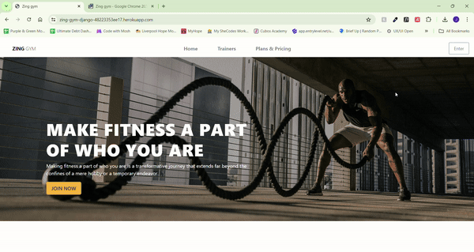

# Testing

## Manual Testing

### Device and Browser Testing

|**Testing**|**iPhone 12 safari**|**iPad Air 10.2" safari**|**HP Pavillion OS Edge**|**HP Pavillion OS Chrome**|**Chrome Developer Tools**|
|-----|-----|-----|-----|-----|-----|
|Responsive|Yes|Yes|Yes|Yes|Yes|
|Navbar working properly|Yes|Yes|Yes|Yes|Yes|
|Buttons work|Yes|Yes|Yes|Yes|Yes|
|Forms having the corrent validating|Yes|Yes|Yes|Yes|Yes|
|User information displays|Yes|Yes|Yes|Yes|Yes|
|Purchase History display on user profile|Yes|Yes|Yes|Yes|Yes|

### Security Measures 
- All pages are secured that only admin users can acess the data stored as '@login_required' is added before each implementation on the views files. 

- If a user tries to access the admin data by the url the system identify with the user has the credentials for it. 

- Users must login to access some pages.

- Only admin users has additionals functionalities on th toggle menu.

## Broken links 
The final deployment is free of broken links as in other version the trainers checkout page did not load and broke shwoing error 504.

## Solved Bugs

|**Bug**|**Resolution**|
|-----|-----|
|Plans prices not being separated, then not passing right to checkout| Add hidden inputs and set then to each plan price, also separate the prices into two buttons.
|Purchase hisotry not displying the payments| Fix payment view and add purchase hitory function inside profile view.
|Purchase hisotry cancel button not working| Correct payment view where noce clicked the informstion regarding the payment reference would be located and changed. Also, disable the button once the status change to 'cancelled'
|AWS storage not displayed files and media to the website| Setup the correct configuration.